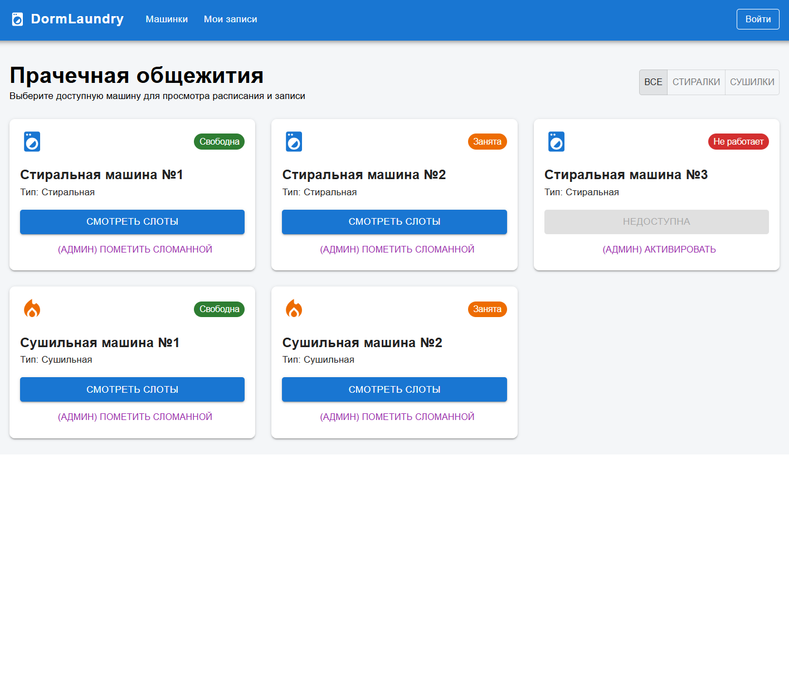
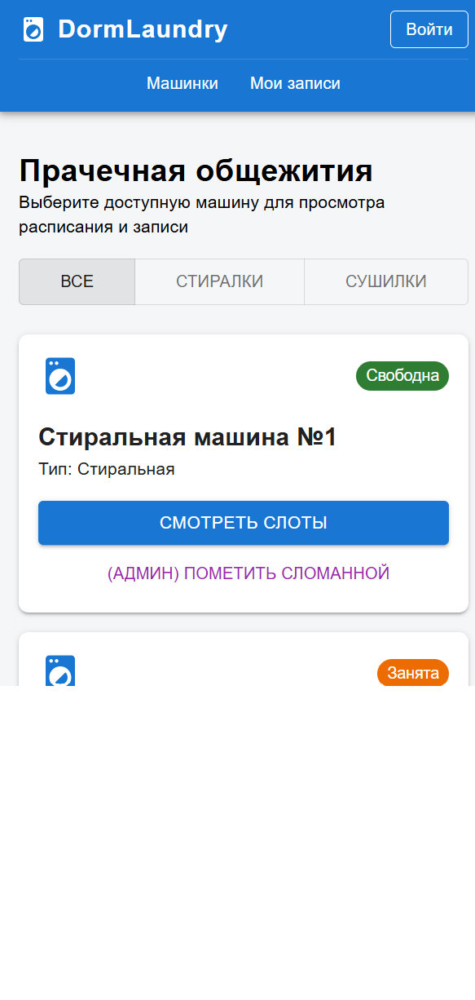
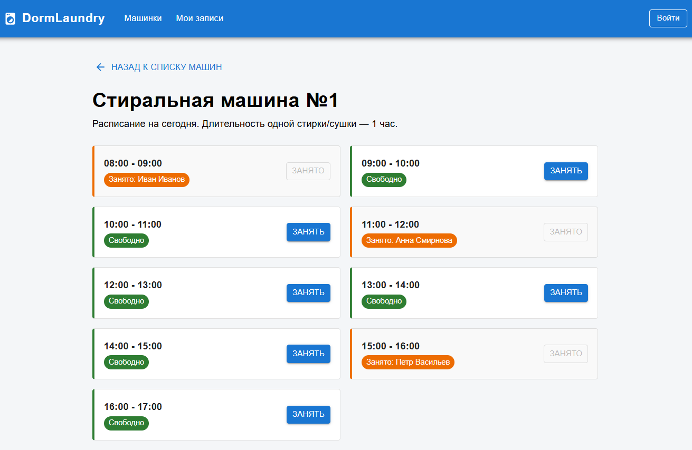
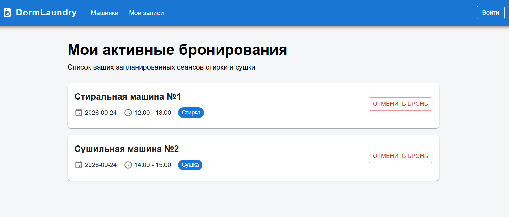
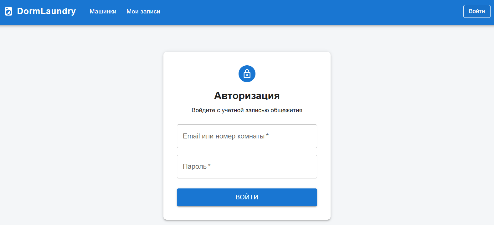

DormLaundry - расписание стиралок общежития

Fullstack-приложение для бронирования стиральных и сушильных машин в общежитии.

Назначение приложения:
Приложение предназначено для студентов, проживающих в общежитии, для просмотра статуса стиральных и сушильных машин, а также бронирования удобного времени стирки. Цель - избавление от живых очередей и оптимизация времени студентов.

Основные пользовательские сценарии
1. Студент: Авторизация в системе.
2. Студент: Просмотр списка доступных машин и их текущего статуса.
3. Студент: Выбор машины и бронирование свободного часового слота в расписании.
4. Студент: Просмотр своих активных бронирований и их отмена.
5. Администратор: Изменение статуса машины (например, отметка "Не работает").

Необходимые экраны
Экран авторизации/регистрации — форма входа.
Главный экран (Список) — карточки машин с индикаторами (свободна/занята/сломана).
Экран расписания (Бронирование) — календарь/список слотов для конкретной машины.
Экран профиля (Мои записи) — список будущих стирок пользователя.

Интерфейс приложения (Скриншоты экранов)

1. Каталог оборудования (Десктопная версия)
Отображение доступных стиральных и сушильных машин с фильтрацией по типу и статусам.

2. Мобильное представление
Адаптивная верстка интерфейса для экранов смартфонов (ширина до 600px).

3. Расписание и бронирование слотов
Сетка доступных и занятых временных интервалов с возможностью бронирования.

4. Мои бронирования
Список активных записей пользователя с возможностью их отмены.

5. Авторизация
Форма входа в систему для жильцов общежития.
